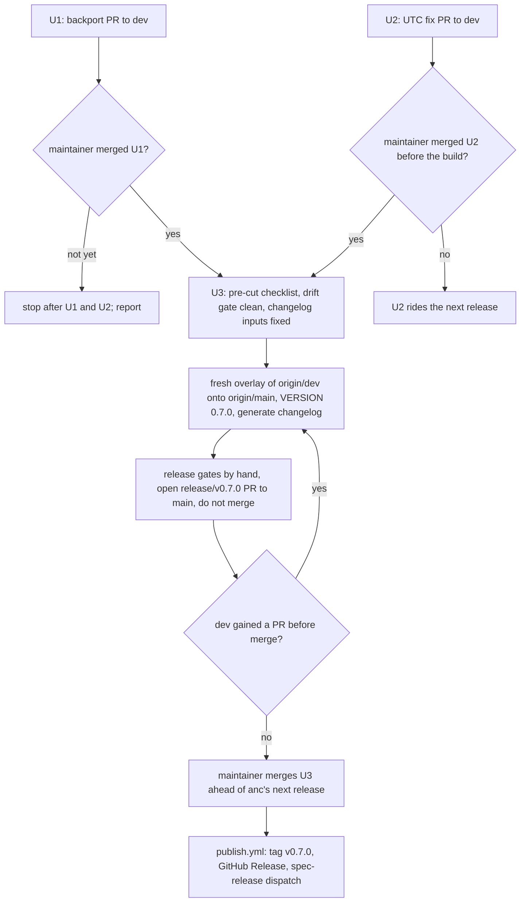

# Spec v0.7.0 Release - Plan

**Target repo:** `brettdavies/agentnative` (the spec repo, checked out locally as `agentnative-spec`).

## Goal Capsule

- **Objective:** A v0.7.0 release of the standard, carrying the rule text anc's next release scores, is ready for the
  maintainer to merge. The release keeps the 0.6.0 changelog history, and contributors' `last-revised` checks agree with
  CI at any hour.
- **Means:** backport the v0.6.0 bookkeeping to `dev` (KTD1), fix the checker's date in its own PR (KTD2), then build
  the release by the runbook's overlay recipe and rebuild it whenever `dev` moves (KTD4).
- **Authority:** the maintainer's instructions in R7 outrank everything else. `RELEASES.md` governs release mechanics.
  This plan governs sequencing and scope.
- **Execution profile:** three PRs in `brettdavies/agentnative`, each started from a fresh standalone clone with a clean
  tree and no untracked files (KTD6). U3, and each later rebuild of it, runs in a new invocation the maintainer starts;
  that invocation resumes at U3 when the U1 and U2 PRs already exist.
- **Stop conditions:**
  - U1 is not merged yet: open U1 and U2, report, and stop before U3.
  - Any drift-gate failure other than gate 0's backport condition: stop and report.
  - A PR in the changelog window whose `## Changelog` section is missing or wrong and cannot be corrected on its body:
    stop and report.
  - Any step that would merge a PR: stop. Merging is the maintainer's act.
- **Who finishes:** the maintainer merges U1 and U2 into `dev`, then merges the U3 release PR into `main` ahead of anc's
  next release (see Risks & Dependencies). Merging U3 fires `publish.yml`, which tags v0.7.0, creates the GitHub
  Release, and dispatches `spec-release` downstream. Everything after that is follow-up work.

---

## Product Contract

### Summary

Publish spec v0.7.0 so the tagged standard carries #58's corrected rule text. Before the cut, `dev` receives the v0.6.0
bookkeeping it never got, and the `last-revised` checker computes its date in UTC. The executing session opens three PRs
and merges none of them.

### Problem Frame

v0.6.0 states three MUSTs more strictly than anc's `dev` branch scores them, and its "Measured by" lines name audit IDs
anc does not report. #58 corrected the text on `dev`: the P2 schema surface, P3 subcommand examples, and P5 confirmation
flag now accept documented equivalents or exempt cases, and the audit-ID lists in P1, P2, P5, P6, and P8 are real. The
matching auditor changes (agentnative-cli #142 and #147) are merged to anc's `dev` and ship in anc's next release; the
released anc v0.6.0 still grades the strict wording. agentnative-cli, agentnative-site, and agentnative-skill vendor the
latest `v*` tag, so no consumer sees #58's text until a tag exists.

The cut is blocked today. The v0.6.0 backport never ran, so `origin/dev:VERSION` reads 0.5.0 and `dev`'s `CHANGELOG.md`
lacks the 0.6.0 section. `scripts/release/drift.sh` gate 0 fails for exactly that reason (gates 1 and 2 pass). The
overlay recipe copies `dev`'s `CHANGELOG.md` onto `main`, so cutting now would delete the 0.6.0 entry from `main` and
emit a `v0.5.0...v0.7.0` compare link into the GitHub Release notes.

Separately, `scripts/check-last-revised.mjs` builds "today" from local-time getters while CI runs in UTC. #58's own
first check run failed at 03:37Z with `'last-revised' is 2026-10-05, not today (2026-10-06)`: the contributor stamped
the Central-time date, and CI expected the UTC one.

### Requirements

**Release bookkeeping**

- R1. Before the release branch is built, `dev` carries VERSION 0.6.0 and `main`'s `CHANGELOG.md`, delivered by the
  repo's backport script.
- R2. The v0.7.0 release preserves every existing changelog section, 0.6.0 included, unchanged.

**Date checker**

- R3. `scripts/check-last-revised.mjs` computes "today" as the UTC calendar date, so local runs, `--fix`, the pre-push
  hook, and CI agree at any hour in any time zone.
- R4. The checker's header comment and the `last-revised` field rule in `principles/AGENTS.md` both state the UTC rule.

**Release**

- R5. A `release/v0.7.0` PR against `main` carries `dev`'s tree, VERSION 0.7.0, and a generated `## [0.7.0]` changelog
  section built from the PRs merged into `dev` since v0.6.0. Every bullet in that section is a written changelog entry,
  never a fallback PR title. The PR is built by the overlay recipe in `RELEASES.md` and passes its pre-cut checklist.
- R6. The release PR stays open. When `dev` gains another PR before the maintainer merges, the release branch is rebuilt
  so its tree again equals current `dev`, minus the guarded paths and the version files.

**Execution authority**

- R7. The executing session opens PRs and merges none. Merging, and therefore tagging, belongs to the maintainer.

### Key Decisions

- **No merges by the executing session.** (session-settled: user-directed — chosen over merging each PR once CI is
  green: more spec updates may land the same day, and the release PR stays open to absorb them.) Governs R6, R7.
- **Version 0.7.0, a minor bump.** (session-settled: user-approved — chosen over 0.6.1: #58 changes three `level: must`
  requirements, and `CONTRIBUTING.md` classifies MUST changes as MINOR.) Governs R5.

### Scope Boundaries

- No principle text changes. The release ships `dev`'s principle files as they stand.
- No merging, tagging, or GitHub Release by hand. `publish.yml` does all three when the maintainer merges U3.
- Considered and not built: changing the rule that `last-revised` must equal today. A PR pushed just before midnight UTC
  and checked just after still fails it, in every time zone. That residual case is separate from the time-zone bug U2
  fixes, and is worth revisiting if a PR gets blocked by it.

#### Deferred to Follow-Up Work

- The post-release checklist in `RELEASES.md` (`publish.yml` green, tag and Release exist, `spec-release` dispatch
  delivered), after the maintainer merges U3.
- The v0.7.0 backport: `scripts/sync-dev-after-release.sh v0.7.0` once the tag exists, so the next cut does not hit this
  gate-0 failure again.
- Downstream re-vendors at v0.7.0: agentnative-cli, agentnative-site (sync plus the manual reconciliation of its
  principle copy and its displayed spec version), and agentnative-skill (manual sync, not on the dispatch list).
- Pre-push stage 7 (`generate-pack-readme.mjs --check`) fails on every release tree because the release strips
  `styles/`, so no release branch can be pushed through the hook. It should skip when `styles/` is absent, as stage 8
  skips when its tool is absent.
- `generate-changelog.py`'s release-window start compares ISO timestamps with mixed offsets as strings, so it can pick
  the later of the tag time and the release-PR time. No PR fell in that gap for this release.

### Sources

- `RELEASES.md` § Releasing dev to main (pre-cut checklist, overlay recipe), § Release gating, § Post-release checklist,
  § After publish: sync `dev` with the release, § Prose scrubbing.
- `CONTRIBUTING.md` (version policy: MUST changes are MINOR).
- `docs/syncs.md` (downstream consumers and the `spec-release` dispatch).
- `docs/solutions/workflow-issues/post-release-backport-prevents-diff-b-false-positives-2026-05-07.md` (why the backport
  runs after every tagging release).
- `docs/solutions/logic-errors/utc-pin-calendar-date-math.md` (pin calendar-date math to UTC).
- #52 (`chore(release): sync dev after v0.5.0`), the pattern and body shape U1 repeats.
- #57 (`fix(release): stamp the changelog section in UTC`), the precedent U2 follows in `scripts/generate-changelog.py`.

---

## Planning Contract

### Key Technical Decisions

- KTD1. **Backport first; build the release only after the maintainer merges it.** The overlay takes `dev`'s
  `CHANGELOG.md` verbatim, and `drift.sh` gate 0 holds the cut until `dev` carries the v0.6.0 bookkeeping (R1, R2).
  Restoring `main`'s `CHANGELOG.md` by hand after the overlay would let a release PR open today, but it hand-edits a
  generated file and opens the PR with a red go/no-go gate. The site's release flow skips its backport by the
  maintainer's choice; this repo's runbook requires one, and gate 0 enforces it.
- KTD2. **"Today" is the UTC calendar date.** CI runs in UTC, frontmatter dates already convert through `toISOString()`
  (js-yaml parses a bare date as UTC midnight), and the changelog stamp moved to UTC in #57. The `CHECK_LR_TODAY`
  override stays, so the existing fixtures keep working (R3).
- KTD3. **Prove the fix against the real clock in two time zones on opposite sides of UTC.** The test runs the checker
  without `CHECK_LR_TODAY`, once at UTC+14 and once at UTC-12. Those offsets span 26 hours, so at any instant at least
  one zone's local date differs from the UTC date, and the unfixed checker fails at least one case at any hour,
  including on a UTC CI runner. A single zone is not enough: at 20:59Z on 2026-10-06 the unfixed expression gave the UTC
  date under both Central time and UTC-12. Every existing case sets `CHECK_LR_TODAY`, which is why the bug has no
  failing test today (R3).
- KTD4. **Rebuild the release branch from scratch when `dev` moves.** A fresh overlay from `origin/main`, pushed with
  `--force-with-lease`, keeps R6's tree-equality check meaningful and lets the generator see every newly merged PR. A
  from-scratch rebuild is also the only way to restamp the 0.7.0 section, because the generator keeps an existing
  section's date on a rerun. The section's date is therefore the date of the last rebuild; `publish.yml` matches by
  version, not date (R5, R6).
- KTD5. **Correct changelog inputs on the PR bodies, never in `CHANGELOG.md`.** The generator turns a PR with no
  changelog content into a raw-title bullet unless its type is `chore`, `ci`, `build`, `style`, or `test`. #57
  (`fix(release)`) has an empty `## Changelog`, so it gets a written `### Fixed` bullet on its merged PR body, and U2's
  body carries its own. Retyping #57 would hide a release-infrastructure fix that the changelog's own scope records
  (R5).
- KTD6. **Start every unit from a fresh standalone clone, and push the release branch without the pre-push hook.** The
  backport script refuses a tree with untracked files, and the overlay's stage-all step sweeps any untracked file into
  the release commit. Activate the hooks (`core.hooksPath scripts/hooks`) for U2 only, and let the hook install its own
  js-yaml before anything else runs. U1 runs without them: after the backport script commits, its changelog regen check
  rewrites the one bare carriage return in `CHANGELOG.md` (see U1), and the pre-push clean-tree check would refuse the
  push before the PR opens; no hook stage checks `VERSION` or `CHANGELOG.md` anyway. On the release branch, pre-push
  stage 7 fails on every release tree (see Deferred to Follow-Up Work), so U3 runs the release gates by hand instead.

### High-Level Technical Design

### Risks & Dependencies

- **anc lockstep: the spec goes first.** anc's `build.rs` compiles the vendored spec's requirement summaries and its
  `SPEC_VERSION` into the binary, and anc vendors the latest `v*` tag. An anc release cut before v0.7.0 exists would
  grade by #58's rules while printing the 0.6.0 summaries and reporting spec 0.6.0, and correcting that takes another
  anc release. So the order is U3 merge, then agentnative-cli re-vendors v0.7.0, then anc releases. Between the tag and
  that anc release, the published spec is more lenient than the shipped auditor; the maintainer keeps that window short.
  U3's `## Linked audit review` names agentnative-cli #142 (P3 examples exemption) and #147 (P5 confirmation flags, P2
  schema command) as merged to anc's `dev` and unreleased, matching #58's own Linked audit review.
- **Backport PR has no CI.** No `dev` workflow matches `VERSION` or `CHANGELOG.md`, so U1's checks list stays empty. The
  report says so, so the empty list is not read as pending checks.

### Assumptions

Scoping confirmation was skipped for this plan, so these are unvalidated bets:

- The changelog window is #55, #57, and #58, plus U2 if it merges before U3's last rebuild. #54 merged before the v0.6.0
  tag, and the generator excludes U1 by its `chore(release): sync dev` title.
- U2 ships in v0.7.0 when it merges before U3's last rebuild, and rides the next release otherwise. It touches no
  principle file, so it neither triggers nor blocks a tag.
- `git log origin/main..origin/dev --grep '!:'` reports #40 (`refactor(spec)!: rename check to audit`) only because the
  squash lineage reaches back to the scaffold. #40 shipped in v0.5.0, so it gets no breaking-changes row, and no PR
  title in the real window carries `!:`.
- A 0.7.0 section dated earlier than the merge day is acceptable. The maintainer can ask for one more rebuild on the
  merge day to align the section date with the tag date.

---

## Implementation Units

### U1. Backport the v0.6.0 bookkeeping to `dev`

- **Goal:** `dev` carries VERSION 0.6.0 and `main`'s `CHANGELOG.md`, so `drift.sh` gate 0 passes once the PR merges.
- **Requirements:** R1, R2, R7; KTD1, KTD6.
- **Dependencies:** none.
- **Files:** `VERSION`, `CHANGELOG.md` (both written by the script).
- **Approach:**
  1. In a fresh clone without hooks (KTD6), run `scripts/sync-dev-after-release.sh v0.6.0`. It cuts
     `chore/sync-dev-after-v0.6.0`, writes both files, commits, pushes, and opens a PR against `dev`.
  2. Restore `CHANGELOG.md` in the working tree. `main`'s copy has one bare carriage return (line 23, the #48
     Documentation bullet), and the script's post-commit `generate-changelog.py --dry-run` rewrites it as a newline in
     the working file. The committed file is unaffected.
  3. Replace the script's generated PR body, which uses a different template shape, with one built from
     `.github/pull_request_template.md`: the five sections #52 used, an empty `## Changelog`, and "no audit changes
     needed" under Linked audit review. Scrub it per `RELEASES.md` § Prose scrubbing.
  4. Switch the clone back to `dev`: the script leaves it on the backport branch.
  5. Leave the PR open (R7).
- **Patterns to follow:** #52, the same backport for v0.5.0.
- **Test expectation:** none. The script copies released bookkeeping; the checks below verify it.
- **Verification:**
  - The PR diff touches only `VERSION` and `CHANGELOG.md`.
  - The branch's `CHANGELOG.md` is byte-identical to `origin/main`'s.
  - `drift.sh` with `--base` set to the PR head reports gate 0 passing.

### U2. Compute the `last-revised` "today" in UTC

- **Goal:** the checker and CI agree on "today" at any hour in any time zone.
- **Requirements:** R3, R4, R5, R7; KTD2, KTD3, KTD5, KTD6.
- **Dependencies:** none. Independent of U1; cut its branch from `dev`, not from U1's branch.
- **Files:**
  - `scripts/check-last-revised.mjs`
  - `scripts/test-check-last-revised.mjs`
  - `principles/AGENTS.md` (the `last-revised` field bullet)
- **Approach:**
  1. Return the UTC calendar date from the "today" helper, rename it to match, and keep the `CHECK_LR_TODAY` override.
  2. Update the header comment's "today's local date" statements and the `--fix` description to say UTC.
  3. In `principles/AGENTS.md`, state that "today" means the UTC date.
  4. Open the PR against `dev` from a `fix/` branch. Its body carries a `### Fixed` changelog bullet, the #58 check-run
     failure as evidence, and the residual midnight-UTC case from Scope Boundaries. Leave it open (R7).
- **Execution note:** write the time-zone cases first and observe them fail against the unfixed checker, quoting the
  failure in the PR.
- **Patterns to follow:** the UTC stamp in `scripts/generate-changelog.py` (#57). The throwaway-repo harness in
  `scripts/test-check-last-revised.mjs` builds each case from a base commit and a head mutation.
- **Test scenarios:**
  - With `TZ` at UTC+14 and `CHECK_LR_TODAY` removed from the spawned environment, `--fix` on a fixture whose
    frontmatter changed stamps the current UTC date.
  - The same case at UTC-12 stamps the same UTC date.
  - Before trusting either case, the test confirms the zone took effect: a child process under each `TZ` reports offset
    `-840` and `720` minutes. An unknown zone silently falls back to UTC, and the `Etc/GMT` sign is inverted.
  - In read-only mode, a changed fixture already stamped with the UTC date passes in both zones.
  - The expected date accepts the UTC date sampled before the run or the one sampled after it, so a run that crosses
    midnight UTC cannot flake.
  - Every existing case still passes with `CHECK_LR_TODAY` set, unchanged.
- **Verification:**
  - The new cases fail on the unfixed checker and pass after the change.
  - The pre-push hook (stages 5b and 5c) and the `check-last-revised` workflow on the PR are green.

### U3. Build and open the v0.7.0 release PR

- **Goal:** a `release/v0.7.0` PR against `main` that the maintainer can merge to publish v0.7.0.
- **Requirements:** R2, R5, R6, R7; KTD1, KTD4, KTD5, KTD6.
- **Dependencies:** the maintainer has merged U1. U2 is optional (see Assumptions).
- **Files:** `VERSION` and `CHANGELOG.md`, plus the overlay of `dev`'s tracked tree. No hand edits elsewhere.
- **Approach:**
  1. Fix the changelog inputs: add a `### Fixed` bullet to #57's merged PR body (KTD5).
  2. Clear every box in `RELEASES.md` § Pre-cut checklist. Scope the breaking-marker check to the generator's window
     rather than `origin/main..origin/dev` (see Assumptions).
  3. In a fresh clone without hooks, build the branch by the overlay recipe: VERSION 0.7.0, then
     `scripts/generate-changelog.py --from-dev-prs`, then the recipe's A, B, and D checks, the commit, and the second
     drift run.
  4. Scrub `CHANGELOG.md` per `RELEASES.md` § Prose scrubbing. Fix any finding on the upstream PR body, then rebuild
     from step 3.
  5. Run the release gates by hand (KTD6): `scripts/check-release-version.sh` on the branch, and `publish.yml`'s section
     extraction against the branch's `CHANGELOG.md`.
  6. Push and open `release: v0.7.0` against `main` with the repo template. **Linked audit review** carries the anc
     lockstep note from Risks & Dependencies.
  7. Leave it open (R7). Each time `dev` gains a PR before the merge, rebuild from step 2 (KTD4), force-push with lease,
     and refresh the body.
- **Test expectation:** none. This unit assembles a release; the gates below verify it.
- **Verification:**
  - The recipe's check A prints only `VERSION` and `CHANGELOG.md` as deltas from `dev`, and check B finds no guarded
    paths.
  - `CHANGELOG.md` holds a `## [0.7.0]` section of written bullets (#58's three Changed and one Fixed, #57's Fixed, and
    U2's if merged), a `v0.6.0...v0.7.0` compare link, and the `## [0.6.0]` section and everything below it unchanged
    from `origin/main`. The one permitted difference is the bare carriage return in the 0.6.0 #48 bullet, which the
    generator's text-mode write turns into a newline; it renders the same, and any other difference fails the check.
  - `publish.yml`'s extraction prints a non-empty 0.7.0 section from the branch's `CHANGELOG.md`.
  - `check-release-version.sh` accepts 0.7.0 as greater than `main`'s 0.6.0, with no `v0.7.0` tag on origin.
  - Every required check on the PR (`guard-docs`, `guard-release`, `guard-provenance`) is green by rollup.

---

## Verification Contract

| Gate                        | Command                                                                                                                                    | Applies to                                                                  |
| --------------------------- | ------------------------------------------------------------------------------------------------------------------------------------------ | --------------------------------------------------------------------------- |
| Checker regression tests    | `node scripts/test-check-last-revised.mjs`                                                                                                 | U2                                                                          |
| Checker against the PR base | `node scripts/check-last-revised.mjs origin/dev`                                                                                           | U2                                                                          |
| Pre-push pipeline           | `scripts/hooks/pre-push`, run on `git push` once `core.hooksPath` is `scripts/hooks`                                                       | U2                                                                          |
| Release drift gate          | `scripts/release/drift.sh`                                                                                                                 | U1 (with `--base` at the PR head), U3 (before and after the overlay commit) |
| Release version check       | `scripts/check-release-version.sh`, run by hand on `release/v0.7.0`                                                                        | U3                                                                          |
| Changelog build             | `scripts/generate-changelog.py --from-dev-prs`                                                                                             | U3                                                                          |
| Release-notes extraction    | the `awk` from `publish.yml`'s "Extract CHANGELOG section" step, run against the branch's `CHANGELOG.md`                                   | U3                                                                          |
| Prose scrub                 | `vale --no-global --minAlertLevel=error`, `lt_check`, and `~/.claude/skills/unslop/scripts/score.py` on each PR body and on `CHANGELOG.md` | U1, U2, U3                                                                  |
| PR checks                   | `gh pr view <n> --json statusCheckRollup`, every live conclusion `SUCCESS`                                                                 | U2, U3                                                                      |

---

## Definition of Done

- U1 and U2 are open against `dev` and stay unmerged; U2's checks are green.
- Once the maintainer merges U1, U3 is open against `main` with green checks and stays unmerged.
- U3's tree equals current `dev` minus the guarded paths and the version files, as of its latest rebuild, and its 0.7.0
  section contains no raw-title bullets.
- The executing session reports each PR's number and state, the `origin/dev` SHA the release branch was built from (so
  the maintainer can confirm `dev` has not moved before merging), the 0.7.0 section's date, the anc lockstep note, and
  the items under Deferred to Follow-Up Work.
- No scratch files, temporary PR bodies, or abandoned branches remain.
