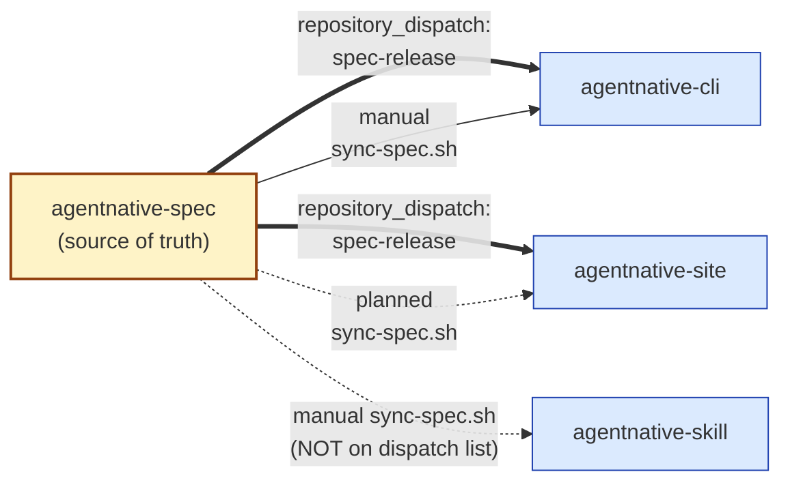
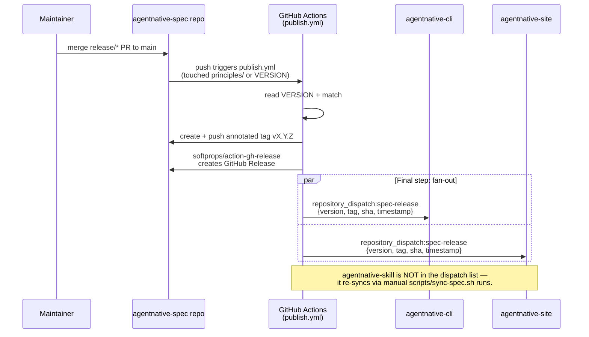

# Cross-repo sync map

How spec content flows out of this repo, and (if applicable) what flows in. Source of truth: this file. Update when sync
mechanisms change.

`agentnative-spec` is the canonical source-of-truth at the top of the dependency chain. The authoritative artifacts —
`principles/p*-*.md`, `VERSION`, `CHANGELOG.md` — are produced here and consumed by sibling repos via a
**commit-a-copy** sync model (no submodules, no build-time fetches). Each consumer pulls at a pinned spec tag and
commits the vendored copy into its own tree, so consumer builds are reproducible without network access to this repo.

For the rationale behind commit-a-copy over submodule/build-time fetch, see
[`solutions/cross-repo-artifact-sync-commit-over-fetch`](solutions/) (search via `qmd query "cross-repo artifact sync"
--collection solutions`).

## Upstream — data flowing INTO this repo

None. `agentnative-spec` is the canonical source-of-truth at the top of the dependency chain. All inbound changes are
direct edits in this repo via the `dev` → `release/*` → `main` flow documented in [`RELEASES.md`](../RELEASES.md).

## Downstream — data flowing OUT of this repo

Solid arrows are wired `repository_dispatch` events; dashed arrows are manual-only or planned. The skill repo is
intentionally absent from the dispatch fan-out (see Release / dispatch chain below).

| Consumer                                                                            | Mechanism                                                                                                           | What's synced                                                                                                                            | Trigger                                                                                                                                                                   | Drift check                                                                                                                                                                                                                                                                     |
| ----------------------------------------------------------------------------------- | ------------------------------------------------------------------------------------------------------------------- | ---------------------------------------------------------------------------------------------------------------------------------------- | ------------------------------------------------------------------------------------------------------------------------------------------------------------------------- | ------------------------------------------------------------------------------------------------------------------------------------------------------------------------------------------------------------------------------------------------------------------------------- |
| [`brettdavies/agentnative-cli`](https://github.com/brettdavies/agentnative-cli)     | `scripts/sync-spec.sh` in **cli repo** (manual run); resolves latest `v*` tag via remote-first, falls back to local | `principles/p*-*.md` + `VERSION` + `CHANGELOG.md` → `src/principles/spec/`                                                               | On spec release; rerun after every new tag. `build.rs` codegens the `REQUIREMENTS` slice from the vendored copy.                                                          | `build.rs` fails on parse error / missing fields / duplicate IDs. Pre-push hook validates frontmatter parity.                                                                                                                                                                   |
| [`brettdavies/agentnative-skill`](https://github.com/brettdavies/agentnative-skill) | `scripts/sync-spec.sh` in **skill repo** (manual run); same remote-first resolution, mirrors cli's script           | `principles/p*-*.md` + `VERSION` + `CHANGELOG.md` → `spec/`                                                                              | On spec release; ships as part of the skill bundle so consuming agents carry the canonical principle text alongside skill metadata.                                       | (unknown — verify with skill repo) The vendored tree is checked into the skill bundle; stale orphan files surface via `git status` at commit time per the script's own comment.                                                                                                 |
| [`brettdavies/agentnative-site`](https://github.com/brettdavies/agentnative-site)   | **PLANNED, not yet built**: would add `scripts/sync-spec.sh` to pull into `src/data/spec/` (or equivalent)          | Same files (principles, VERSION, CHANGELOG)                                                                                              | On spec release; planned to consume the `repository_dispatch` event below.                                                                                                | Currently the site has no sync — `SPEC_VERSION` is hardcoded as a stub in the site shell. Plan tracked at `agentnative-site/docs/plans/2026-04-23-001-feat-sync-spec-plan.md`.                                                                                                  |
| GitHub Releases (`brettdavies/agentnative` releases)                                | [`.github/workflows/publish.yml`](../.github/workflows/publish.yml) — `softprops/action-gh-release` step            | Annotated tag `vX.Y.Z` + GitHub Release with `CHANGELOG.md` `## [X.Y.Z]` section as body                                                 | Push to `main` that touches `principles/p*-*.md` OR `VERSION`, gated on a matching `## [VERSION]` entry in `CHANGELOG.md`. Also `workflow_dispatch` with `version` input. | Tag-exists guard refuses to re-tag a published version (both local and origin checks). VERSION MUST be bumped to cut a new release.                                                                                                                                             |
| `repository_dispatch` event `spec-release` → cli + site                             | [`.github/workflows/publish.yml`](../.github/workflows/publish.yml) — final "Dispatch to downstream consumers" step | Event payload: `{version, tag, sha, timestamp}` posted to `brettdavies/agentnative-cli` AND `brettdavies/agentnative-site` `/dispatches` | Successful tag-cut on `main` (only if `CHANGELOG.md` has the matching `## [VERSION]` section); requires `CI_RELEASE_TOKEN` secret to be set                               | Non-fatal: each dispatch wraps `gh api` and emits `::warning::` on failure but does not fail the workflow. Downstream consumers opt in by wiring handlers in their own repos. The skill repo is **not** in the dispatch list — it relies on manual `scripts/sync-spec.sh` runs. |

### Files vendored downstream — exact paths per consumer

| Consumer            | Destination root in consumer repo | Subtree shape                                   |
| ------------------- | --------------------------------- | ----------------------------------------------- |
| `agentnative-cli`   | `src/principles/spec/`            | `principles/p*-*.md`, `VERSION`, `CHANGELOG.md` |
| `agentnative-skill` | `spec/`                           | `principles/p*-*.md`, `VERSION`, `CHANGELOG.md` |
| `agentnative-site`  | (planned, e.g. `src/data/spec/`)  | (planned: same shape as above)                  |

The cli and skill scripts are intentionally near-identical mirrors; only `DEST_DIR` differs. See the script header in
`agentnative-cli/scripts/sync-spec.sh` and the matching note in `agentnative-skill/scripts/sync-spec.sh` ("Mirror of
agentnative-cli/scripts/sync-spec.sh; only DEST_DIR differs.").

## Release / dispatch chain

What happens when a release lands on `main`:

1. PR merges from `release/<slug>` to `main`. Squash-merge produces a single commit on `main`.
2. [`.github/workflows/publish.yml`](../.github/workflows/publish.yml) fires if the diff touched `principles/p*-*.md` OR
   `VERSION` (the path filter is OR-logic; either is sufficient — see
   [`RELEASES.md` § Release gating](../RELEASES.md#release-gating)).
3. Workflow reads `VERSION`, looks for a matching `## [VERSION]` section in `CHANGELOG.md`. **If the section is missing,
   the workflow logs a notice and exits cleanly** — no tag, no Release, no dispatch. This is the opt-in gate: a
   principle push without a CHANGELOG bump is a no-op, not an error.
4. If the entry exists: the workflow refuses to proceed if `vVERSION` already exists locally or on origin (tag-exists
   guard), then creates and pushes the annotated tag.
5. `softprops/action-gh-release` creates a GitHub Release with the extracted CHANGELOG section as the body.
6. **Final step — downstream dispatch.** Workflow posts a `repository_dispatch` event of type `spec-release` to BOTH
   `brettdavies/agentnative-cli` and `brettdavies/agentnative-site`, carrying `{version, tag, sha, timestamp}`. The call
   uses `CI_RELEASE_TOKEN` (a fine-grained PAT with cross-repo dispatch permission). Failures are non-fatal — dispatched
   repos opt in by wiring handlers; consumers that haven't wired one yet receive the dispatch as a no-op.

**What the dispatch does NOT do.** It does not push files into consumer repos. Consumers still run their own
`scripts/sync-spec.sh` (manually or via their own repo's automation triggered by the dispatch). The dispatch is a
notification, not a push.

**Manual re-cut.** `publish.yml` accepts `workflow_dispatch` with a `version` input if a tag needs to be re-created
(e.g. a prior run failed partway through). The input MUST match the `VERSION` file on `main`.

**The skill repo is intentionally not in the dispatch list** as of writing. It re-syncs via manual
`scripts/sync-spec.sh` runs. If/when the skill bundle wants automated re-vendoring on spec release, add
`brettdavies/agentnative-skill` to the `for repo in …` loop in `publish.yml`.

## Reference

- Spec publish workflow (this repo): [`.github/workflows/publish.yml`](../.github/workflows/publish.yml)
- CLI's reference implementation: `~/dev/agentnative-cli/scripts/sync-spec.sh`
- Skill's reference implementation (mirror of cli's): `~/dev/agentnative-skill/scripts/sync-spec.sh`
- Site's planned implementation: `agentnative-site/docs/plans/2026-04-23-001-feat-sync-spec-plan.md`
- Release flow and gating: [`RELEASES.md`](../RELEASES.md)
- Cross-repo consumer table: [`AGENTS.md` § Cross-repo context](../AGENTS.md)
- Commit-a-copy rationale: search `qmd query "cross-repo artifact sync commit over fetch" --collection solutions`
